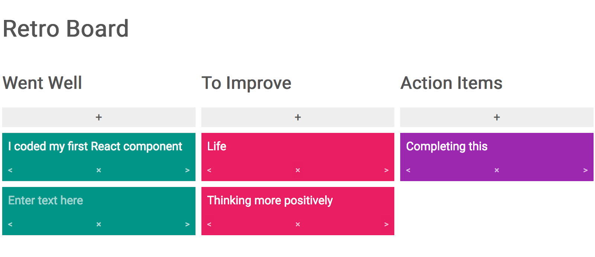
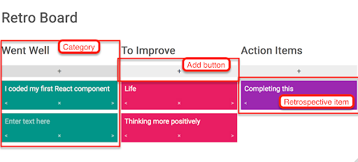

# Project 1: Retro Board

## By: Wade Wallace

### **Note: Initialized with Bun. To run this project, please use `bun dev` instead of `npm run dev`.**

**Due July 29, 2024 End of Day**

For this project, I have created a retrospective board. A retrospective board is used within the Scrum workflow. Scrum is the most popular Agile style of software project management used to guide the software development life cycle. Scrum style management is based on four basic ceremonies for each sprint or software release: the 1.) Sprint Planning meeting, 2.) Daily Stand-up, 3.) Sprint Review, and 4.) Sprint Retrospective. As a part of the Sprint Retrospective, team members will use a retrospective board to reflect on what went well and what they need to improve on for next time.

Here is a quick video overview of the functionality:  

This project is inspired by _GoRetro_. If you are not familiar with a retrospective board, please [visit the GoRetro website](https://www.goretro.ai/) and create a new board.



## Project Goals

- To put together and make practical use of what was taught in class.
- To learn about developer practices, like setting up an application, maintaining your own git repository and writing a _README.md_.
- To build a portfolio piece to show off to potential employers.

This project will bring together these topics covered in class:

- React Components
- Props
- State
- Events in React
- Forms in React
- Lifting State Up

## Getting Started

You first want to create a new React project with Vite.js. Put it somewhere you will remember it. It should be outside of the class repository. Open your terminal or Git Bash:

```shell
# To run, please run the following terminal commands:
cd retro-board/
bun install
bun run dev
```

### UI Requirements



- The Retro Board has three categories: 1.) "Went Well" 2.) "To Improve" and 3.) "Action Items". The categories are displayed in this order. They have beenarranged in such a way that the user can easily tell what UI elements on the page belong to what category.

- Each category contains an add button or another type of UI element. When clicked or activated, the application will add a new retrospective item to the given category.

- The user should be able to type text inside of each retrospective item. This text will be stored in state. The only time the text can change is when the user is typing inside the retrospective item.

- The user can delete each retrospective item. When deleted, the retrospective item should be removed from state and the application.

- The user is able to move the retrospective item into a different category by clicking on a left or right arrow. If there is not a category to the left, then clicking the arrow should move the retrospective item to the rightmost category. The same applies to if there is no category to the right but in reverse. When the item moves from one category to the next, the retrospective item’s user input, visual structure, and appearance (with the exception of color) should stay the same.

- For the final UI requirement, I've chosen the following option:

  - Add a “like” and “dislike” button (or other clickable UI elements) to your retrospective items. Clicking on one of these buttons should change the number of votes for likes (and, optionally, dislikes). Display the number of votes in each retrospective item.

## Project Design

Project design (initial HTML and CSS) provided by instructors and modified by me to meet the requirements of this project.
